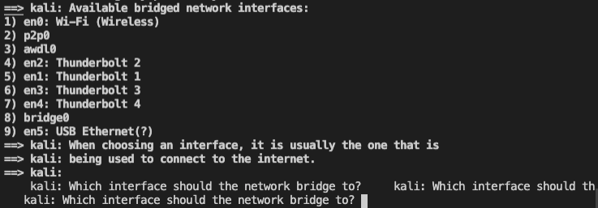
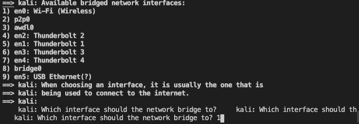
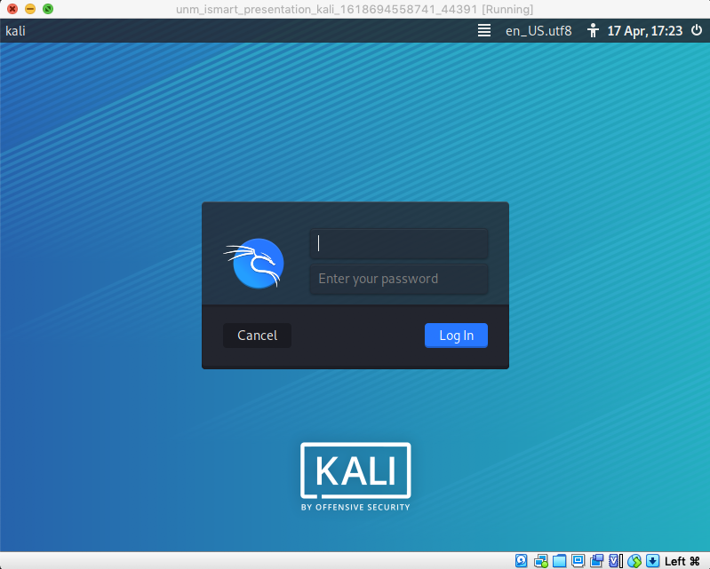

# Virtual Machine Setup
This section will help you to create a Kali VM that can be used to follow along with the topics covered in this repo using [Vagrant](https://www.vagrantup.com/) and [VirtualBox](https://www.virtualbox.org/).

If you want to use Windows, all of the products appear to be supported but we're not going to cover that here. Good luck!
1. Install dependencies
   * Vagrant: https://www.vagrantup.com/downloads
   * VirtualBox: https://www.virtualbox.org/wiki/Downloads

2. Get an active network interface by running this script on Linux or MacOS
   ```
   ifconfig | awk '/UP/{print $1}' | grep 'eth0:\|en0:'
   ```
   **Explanation of this command:**
   * `ifconfig` - used to get network interface configuration
   * `awk '/UP/{print $1}'` - match all of the lines from the output of the previous command that have `UP` in them and print the first column of each match
   * `grep 'eth0:\|en0:'` - match all of the lines from the output of the previous command only with `eth0` OR `en0` in them

   Alternatively, there are plenty of articles on the internet that will show you how to do this through the GUI.

3. Start the VM
    ```
    vagrant up
    # Wait for a bit... Probably 5-10 minutes. It will get faster after you've downloaded the base box for the first time.
    ```
    Find the number that corresponds to the output from Step 2 when you see this prompt:

      
    and then hit the Enter key.

    For example, if your active interface is `en0`, which corresponds to `1)`:

    

4. Login to the VM

   Once you see this window:

   

   You will be ready to authenticate to the system. The credentials are:
   * Username: `vagrant`
   * Password: `vagrant`

At this point, you should feel free to move on to [Virtual Machine Setup](1_vm_setup.md). However, if you want to know how to tear everything down once you're finished with the VM, keep reading.

## Stop the VM
Once you're finished, you can stop the VM with:
```
vagrant halt
```
This will allow you to come back and start the VM again at a later date with `vagrant up`.

## Destroy the VM
**Danger, Will Robinson!**

Running the command in this section will destroy your VM - once you run it, it will be gone forever. There are reasons you may want to do this; perhaps your VM simply isn't working properly or you may want to test something on a fresh system. Whatever your reason is, remember that any data on the old VM will be lost forever.

To **destroy** your VM, run this command:
```
vagrant destroy
```

## Additional Resources

* Vagrant [Setup](https://www.vagrantup.com/docs/installation)
<br/><br/>
[](https://www.youtube.com/watch?v=wX75Z-4MEoM "Network Chuck")