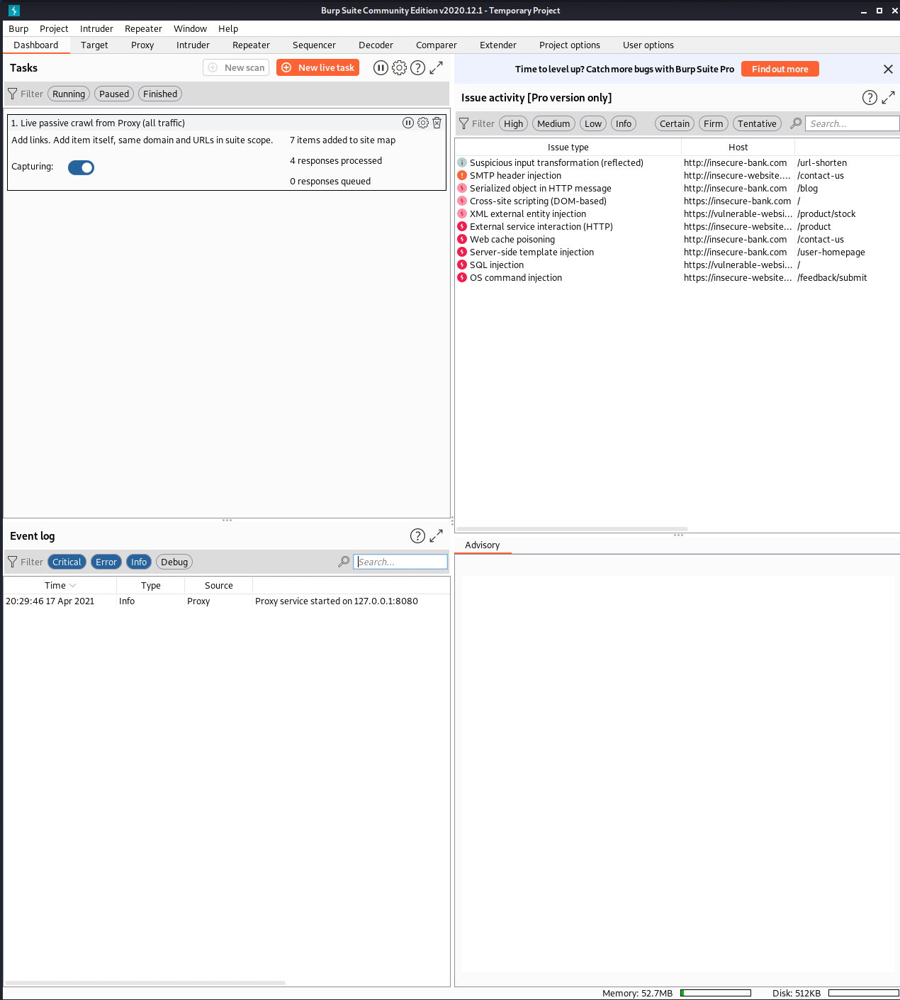

# Virtual Machine Setup
This section will help you to configure the Kali VM that you'll be using to follow along with the content in this repo. 

**Note:** If you want to bring your own system, that's perfectly fine! Feel free to skip to the bottom of this page to move on.

1. Fullscreen your VM
   * On Mac OS, you can use `⌘F`
   * On Linux, you can use `Ctrl F` - note that you have to use the right `Ctrl` key on your keyboard. The left one won't work here by default. 

2. Change the default password

   As you're probably aware, `vagrant/vagrant` is not the most secure username/password combination out there. Let's fix that real quick by opening a terminal window. You can do so by clicking this icon in the upper left-hand corner of the screen:

   

   Once the window is open, type this command in:
   ```
   sudo passwd vagrant
   ```
   and hit the Enter key. When prompted, enter whatever password you desire. The next time you log in, this will be the password that you use for the vagrant user.

3. Install Docker

   Docker facilitates running containers. Containers are used to package applications, which makes it easier to move them to other systems and have them behave the same way as they did on your system.

   While at first glance it may seem like a similar concept to a VM, there are a few key differences. VMs use a hypervisor to virtualize physical hardware, and each VM has a guest OS along with a virtual copy of the hardware needed by the OS to run. Containers, on the other hand, virtualize the OS, so each container only needs to provide an application and its libraries.

   There's plenty more information on the internet that I encourage you to read. Containers are a big deal in the industry and won't be going anywhere anytime soon.

   Run these commands to install Docker:
   ```
   wget https://raw.githubusercontent.com/l50/starter_hack_lab/main/scripts/kali_docker.sh
   bash kali_docker.sh
   ```

   Finish up the install by rebooting your VM:
   ```
   sudo reboot
   ```

4. Start Burp

   [Burp Suite](https://portswigger.net/burp) is a proxy that can be used to intercept web traffic. It is immensely helpful for web application security and is definitely worth spending time to learn. To start it, type this command into a terminal window:
   ```
   burpsuite
   ```
   and hit the Enter key.

   Check the box next to **Don't show again for this JRE** and click **OK** when you see this message:

   

   Click **I Agree** for the terms and conditions.

   If there's an update available, go ahead and click **Close** for now. Don't worry, you'll be prompted again the next time you open Burp. 
   
   At this point, this is roughly what you should see on your screen:

   

   Go ahead and click **Next** and then **Start Burp**

   Burp should now be running. It'll probably look similar to this:

   

   Next, click **Proxy** and then click **Intercept is on** to turn intercept mode off for now. 
   
   The last step for this section is to click **Open Browser**. 
   
   In order to work with both the Browser and Burp, you may consider arranging your windows like so:

   

   Please feel free to click **Cancel** if you see a pop up like this one:

   

At this point, you should feel free to move on to [Web Basics](2_web_basics.md).

## Additional Resources

* Install docker manually - [official install docs](https://docs.docker.com/engine/install/)
* What is Burp - [official documentation](https://portswigger.net/burp)
* Open Source alternative to Burp - [OWASP Zap](https://owasp.org/www-project-zap/)
<br/><br/>
[](https://youtu.be/T47SIBZSVOo)
<br/><br/>
[](https://youtu.be/eGz9DS-aIeY)
<br/><br/>
[](https://youtu.be/3K1-a7dnA60)
