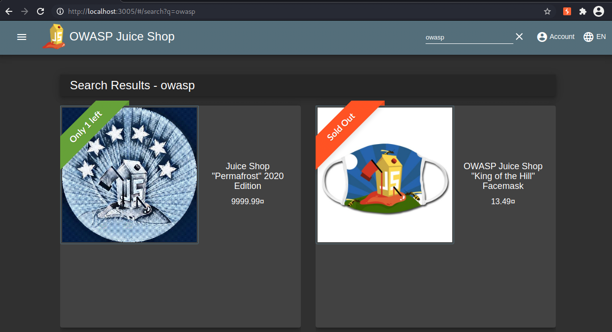

# Vulnerable Targets
This section brings together all of the things that we've done so far. We're going to apply some of what we learned about the web to attack an intentionally vulnerable target.

## Using Docker to get intentionally vulnerable applications
Docker is a subject that we could talk about for hours on end. One application that is especially helpful for aspiring security folks like yourselves is standing up intentionally vulnerable web applications. I'm going to throw you all in the deep end a bit here; we're going to be learning about Docker as we go along, and it'll probably be overwhelming. That's why this stuff is online, so you can revisit it later.

Let's start with one of my favorites, the OWASP Juice Shop.

1. Open the terminal on your VM and open a new tab with Ctrl-Shift-t. Note you can also close tabs with Ctrl-Shift-w
2. Paste in the following command with Ctrl-Shift-p:
   ```
   docker run --rm -d -p 3005:3000 -e NODE_ENV=unsafe --name=juice bkimminich/juice-shop
   ```
3. Wait a minute or so for the container to download
4. Once it has finished, run this command:
   ```
   docker ps
   ```
5. This will show you that there is now a container running called `juice`. It also has a service running on port 3005 on your system. Let's go take a look by navigating to [http://localhost:3005](http://localhost:3005) in your web browser.

You should now have an intentionally vulnerable target that you can do pretty much whatever you want to, and not have to suffer any legal consequences. Pretty neat, eh?

Let's make it even easier to run by adding this command as an alias to your `~/.zshrc` file:
```
echo 'alias juice="docker run --rm -d -p 3005:3000 -e NODE_ENV=unsafe --name=juice bkimminich/juice-shop"' | tee -a ~/.zshrc
```

To make this alias work, either open a new terminal window or run `source ~/.zshrc`. You can stop the currently running container by running:
```
docker stop juice
```

At this point, the container is no longer running. Confirm this by navigating to [http://localhost:3005](http://localhost:3005) in your web browser.

Now you should be able to just type `juice` and hit enter to start a new one. Confirm this by navigating to [http://localhost:3005](http://localhost:3005) in your web browser.

Note that each time you stop and start the container, you will lose your progress. This applies to all containers - if you don't have a mounted volume for whatever data you're working with, you're going to lose it if you lose the container. For this particular one, you can save and restore your progress through buttons on the scoreboard if you'd like.

### Getting a shell to a running container
If we want to get a better sense of how this application is running, we can get a shell to the container and start digging around.

1. This command will get you a shell to the container:
   ```
   docker exec -it juice sh
   ```
2. Running `ls` will show us the various files that make up the application
3. We can also run `ps` to see where the application starts from. There are a few processes that return:
   ```
   PID   USER     TIME  COMMAND
    1 juicer    0:00 {node} npm
   18 juicer    0:06 node build/app
   58 juicer    0:00 sh
   67 juicer    0:00 ps
   ```

   The output tells us a couple of things. First and foremost, this target appears to be built with Node.js, so we can look for known vulnerabilities associated with that language. We also learn that the application is started by running `node build/app`.

   If you're curious, you can execute this command: `cat build/app.js` to view the contents of that particular file.

   I encourage you to spend more time looking around later to get a better sense of how the application is running.

### Attack Methodology
Generally, when I'm looking at a target I like to review the source code if it is made available. In this case, we can view the source code [here](https://github.com/bkimminich/juice-shop), since this is an open-source project.

We will touch a teensy bit on finding vulnerabilities through source code review, but you should really invest time in learning it. It makes you a substantially better hacker.

## A Couple of Common Web Vulnerabilities
Let's touch on some common vulnerabilities in web applications. In particular, how to find them, and why they're a concern.

### Hidden paths in source code
Web applications tend to have several endpoints that a user can browse to. An endpoint is an area of a web application that can be accessed via a URL through an HTTP request. For example, if we click the side menu and then click on **Customer Feedback**:


we will be taken to [http://localhost:3005/#/contact](http://localhost:3005/#/contact). In this case, the endpoint is `/contact`. It follows a `#`, which is used to signal that a fragment identifier will follow it. A fragment identifier is used to grab a resource from the HTML of a given page. It should be noted that this is a client-side operation, which means that anything following a `#` will not be sent back to the server.

To get a better sense of what this means, type Ctrl-Shift-I to pull up open a smaller window on the right-hand side of your screen. This facilitates opening DevTools, an exceptionally useful set of web developer tools built into the browser. Let's go ahead and detach this window to make our lives easier by clicking the three vertical dots in that menu and then clicking this button:


Next, click the **Elements** tab. You should now have a representation of the DOM that you can view. This has the HTML that makes up the page that you're interacting with in your browser. Type in Ctrl-f to search for something on the page. Input `#/contact` and hit enter. You should see something similar to this:


It appears that in this case, the `#` refers to a Hypertext REFerence (`href`): `href="#/contact"`. If you're not familiar, an `href` is used to link to another page on a site. By inputting `#/contact`, we are signaling to our browser that it should try and navigate to that part of the page. These are used quite a bit these days because of the prevalence of single-page applications (SPA) - you should read up on these, but they are out of the scope of this talk.

Web applications oftentimes will have endpoints that don't have any hyperlinks associated with them. Sometimes these endpoints facilitate access to sensitive data or provide a user with the ability to do some elevated action in the application that they shouldn't be able to. A good place to start looking for these is in the JavaScript that's used for the web frontend.

To review this code, we'll use DevTools again. This time click the **Sources** tab. On the left you'll find several files used for the frontend of the application:


We can search all of these files by typing in Ctrl-shift-f and then inputting some string that we want to search for. In this case, we'll go ahead and enable regular expressions and then search for `"\/\w+`:


Regular expressions are outside of the scope of this talk, but you should learn them. This particular one tells us to search for strings that match `"/oneormorewordcharacters`. It should be noted that in a regular expression you need to escape forward slashes (`/`), so that's what the `\/` is about.

This narrowed down our search to two javascript files: `main-es2018.js` and `vendor-es2018.js`.

We can look more closely by clicking the name of the file in the left-hand menu and then clicking `{}` for pretty print. Alternatively, you can also click the **Pretty-print** button when prompted to achieve the same thing:


Now you should be able to click on the file and do another search specific to that file for the same thing by typing Ctrl-f. This will open a search window that's different from the one you used earlier by typing Ctrl-Shift-f. Enable regular expressions and use the same search that we used previously while looking through all files (`"\/\w+`).

This will give you a ton of endpoints that you should investigate. The one we're interested in is `/score-board`, which is found on line 12972. Navigating to this endpoint ([http://localhost:3005/#/score-board](http://localhost:3005/#/score-board)) shows us the various challenges that exist in the project and gives us a flag.

#### Why is this vulnerability a concern?
In this case, the endpoint provides you, the attacker, with a ton of information about vulnerabilities in the web application. For real-world targets, these sorts of endpoints can give an attacker access to administrative functionality, sensitive data, or even provide a means to take over the entire site.

### DOM Cross-Site Scripting (XSS)
You may have noticed that there is a search bar at the top of the page. If you find that you can type something into a site and see your input reflected back to you, this is a sign that you should check for XSS. Let's go ahead and give that a shot here.

To start, search for all products with the word 'owasp' in them. You'll see a bunch of products displayed, but more importantly, your input is indeed reflected back to you on the page:



This is your indicator that it's time to look for XSS. Most people start with `<script>alert('xss')</script>`. If you give that a try, it doesn't appear to work:


Looking at the DOM, it appears that our payload was inserted correctly:


... But it's not working. Fortunately, the scoreboard told us what payload we need to use:


which in turn allows us to complete the challenge:


"How would we find that in the real world?" you may ask. Good question. The answer is lots of trial and error. Essentially, you try a bunch of payloads once you find an area of the site that looks like it may be vulnerable.

More importantly, we should probably answer the question of "Why didn't my first payload work?"

Ultimately, these sorts of questions can be quickly answered by looking at the source code. The two files of interest to us can be accessed by running the following commands from your terminal:
```
docker exec -it juice cat /juice-shop/frontend/src/app/search-result/search-result.component.ts
docker exec -it juice cat /juice-shop/frontend/src/app/search-result/search-result.component.html
```

The first file is a typescript file that is generated by AngularJS, the front-end web framework being used by the project. The line of interest to us in this file is this:


This tells us that the search value is using a known vulnerable method. As per its [documentation](https://angular.io/api/platform-browser/DomSanitizer), the method trusts the given value to be safe HTML.

Great, we know why the vulnerability is there, but why didn't our first payload - `<script>alert('xss')</script> `work?

Looking in the second file, we quickly get our answer:


It turns out the content that we provide for the search value gets inserted into the page via `innerHTML`. [The W3C docs](https://www.w3.org/TR/2008/WD-html5-20080610/dom.html#innerhtml0) tell us that script elements do not get executed when they are inserted into a page via `innerHTML`. So even though the search field is vulnerable to XSS, a `script` payload isn't going to work.

These vulnerabilities are quite common and can be found in several different products. Back in 2017 and 2018, I found a few in a couple of Microsoft products - specifically Sharepoint and Azure. Because Microsoft has a bug bounty program, I actually got paid for these findings! We'll talk about that in a bit - in the meantime, if you want to find more details on those findings, here are the links:

Sharepoint finding: https://msrc.microsoft.com/update-guide/en-US/vulnerability/CVE-2017-8629

Azure finding: https://portal.msrc.microsoft.com/en-US/security-guidance/advisory/CVE-2018-8600

It should be noted that there are multiple types of XSS, but we're not going to cover that here. There's plenty of information you can find on the internet, and ultimately I encourage you to learn what each of them is, and what separates them from the others.

#### Why is this vulnerability a concern?
XSS is an immensely powerful vulnerability. It allows you to run arbitrary JavaScript within the context of a vulnerable application. You as the attacker have a whole language at your disposal - the possibilities are endless.

I find a lot of success daisy chaining XSS with other vulnerabilities for maximum impact. For example, [Jenkins](https://www.jenkins.io/) is a tool that's used to automate building, testing, and deploying software. One of the features it includes is a console in which you can run arbitrary [Groovy](https://groovy-lang.org/) code. So finding a cross-site scripting vulnerability in Jenkins can ultimately be used to get Remote Code Execution (RCE) on the underlying server. RCEs are considered some of the worst vulnerabilities in our industry.

Feel free to teach yourself more about this attack by using a Jenkins container of your very own:
```
docker run --rm -d  -p 8080:8080 -p 50000:50000 --name=jenkins jenkins
```

Additionally, for some awesome and out-of-the-box ideas for XSS, check out [this talk](https://www.youtube.com/watch?v=hKdcDce3FW4).

### XML External Entities (XXE)
The last vulnerability I wanted to cover is XML External Entity attacks. This is one of my personal favorites - it is an injection vulnerability that exploits a vulnerable XML parser. [Extensible Markup Language (XML)](https://en.wikipedia.org/wiki/XML#:~:text=Extensible%20Markup%20Language%20(XML)%20is,free%20open%20standards%E2%80%94define%20XML.) is a markup language that's commonly used to transfer data.

Navigate to http://localhost:3005/#/complain. This is another endpoint you can discover through the methodology we discussed earlier in the `Hidden paths in source code` section.

We are presented with a form which allows us to specify a message and an invoice. Because this form will presumably be read later by someone who may have elevated privileges in the application, this provides us with a number of opportunities to consider. For the message, we could try XSS payloads to see if there's a Blind XSS (go read what that is). Because we can upload a file, we can try uploading a web shell, or we could try uploading some malicious XML. Let's opt to do the latter.

We will create `evil.xml` in the Vagrant user's desktop with our malicious payload in it using the following script:
```
cat > ~/Desktop/evil.xml << 'EOM'
<?xml version="1.0" encoding="UTF-8"?>
<!DOCTYPE foo [<!ELEMENT foo ANY >
        <!ENTITY xxe SYSTEM "file:///etc/passwd" >]>

<trades>
    <metadata>
        <name>Apple Juice</name>
        <trader>
            <foo>&xxe;</foo>
            <name>B. Kimminich</name>
        </trader>
        <units>1500</units>
        <price>106</price>
        <name>Lemon Juice</name>
        <trader>
            <name>B. Kimminich</name>
        </trader>
        <units>4500</units>
        <price>195</price>
    </metadata>
</trades>
EOM
```

Confirm the file is now in place with `cat ~/Desktop/evil.xml`.

Now go back to the page, enter in a random message, and click **Choose File**.

Next, click **Desktop** on the left-hand side.

There is a dropdown menu on the lower right-hand side of the screen that reads "Custom Files." Click this and select **All Files** to reveal `evil.xml`, which you should select and then click **Open**.

Finally, click **Submit**.

To see the fruit of our labors, go to **Proxy** -> **HTTP History** and find the POST request associated with the file upload. Click the associated response to find the contents of the web server's `/etc/passwd` file.

To make sure it's completely clear: we were able to leverage a file upload form to send the application malicious XML. It executed this malicious XML, which allowed us to specify a file that we wanted to read on the underlying filesystem. This file was then displayed back to us in the error response.

These vulnerabilities are not as common as XSS, but they are still plenty to be found. Back in 2018, I found a few in some Oracle and IBM products. More details can be found at these links:

IBM finding: https://www-01.ibm.com/support/docview.wss?uid=swg22015943

Oracle findings: https://www.oracle.com/technetwork/security-advisory/cpujul2018-4258247.html, https://www.oracle.com/technetwork/security-advisory/cpuoct2018-4428296.html

#### Why is this vulnerability a concern?
This vulnerability can allow you to read files on the underlying filesystem, perform SSRF (another vulnerability you should learn about), take down the entire application with a Denial of Service via the [Billion Laughs Attack](https://en.wikipedia.org/wiki/Billion_laughs_attack), and in rare cases even get RCE (only if the application is running PHP and the `expect` module is loaded).

### Insecure Direct Object Reference (IDOR)


#### Why is this vulnerability a concern?
This vulnerability can allow you to access information that your standard account (and/or administrative account in some cases) should not be able to access. This puts data that would otherwise be private at risk of being compromised (e.g. credit card information and mailing addresses). Additionally, this type of vulnerability can cause violations of many privacy policies dependent upon the industry (e.g. HIPAA, GDPR).

### Insecure Direct Object Reference (IDOR)


#### Why is this vulnerability a concern?
This vulnerability can allow you to access information that your standard account (and/or administrative account in some cases) should not be able to access. This puts data that would otherwise be private at risk of being compromised (e.g. credit card information and mailing addresses). Additionally, this type of vulnerability can cause violations of many privacy policies dependent upon the industry (e.g. HIPAA, GDPR).

## Intentionally Vulnerable Targets
If you get through all of the challenges in the juice shop and are looking for more intentionally vulnerable containers, please check out my [containers dotfile](https://github.com/l50/dotfiles/blob/master/containers#L21,L31).

There are also several sites that you can hack on without any fear of getting in trouble.

Here are a few:

https://portswigger.net/web-security/

https://www.hackerone.com/for-hackers/hacker-101

https://github.com/bugcrowd/bugcrowd_university

https://ctfchallenge.com/

At this point, you should feel free to move on to [Bug Bounty Hunting](4_bug_bounty_hunting.md).

## Additional Resources

[](https://youtu.be/IWbmP0Z-yQg)
<br/><br/>
[](https://youtu.be/aSiIHKeN3ys)
<br/><br/>
[](https://youtu.be/uKWu6yhnhbQ)
<br/><br/>
[](https://youtu.be/5oUNvWwKPtI)
